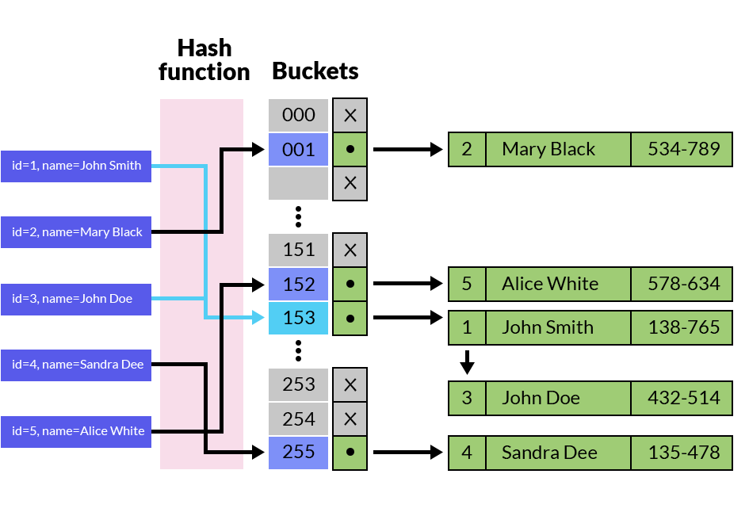

# DATABASE

## Database indexes

Why?

- Understand how databases work.
- Unique
- Solving common problems related to databases and their speed.
- Primary

What?

- An index is just a data structure that makes the searching faster for a specific column in a database. This structure is usually a b-tree or a hash table but it can be any other logic structure.

B-tree


c


```dart
<   <=   =   >=   >
```



```dart
=
```

Lookup faster than b-tree algorithm (O(1) instead of O(log(n)))

**The difference between using a b-tree and a hash table is that the former allows you to use column comparisons in expressions that use the =, >, >=, <, <=, or BETWEEN operators, while the latter is used only for equality comparisons that use the = or <=> operators.**

# References:

https://kieblog.vn/database-indexes-ad-and-disad/

https://dzone.com/articles/database-btree-indexing-in-sqlite

https://hakibenita.com/postgresql-hash-index

http://sqlfiddle.com/#!15/37175/1


---


# DATABASE replication


# Refs:
System Design Interview An Insider’s Guide by Alex Xu (z-lib.org).pdf

