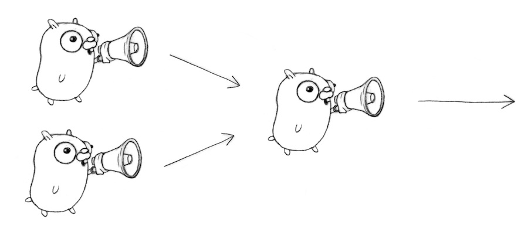

# What is golang?

- The Go programming language is an open-source project to make programmers more productive.
- Go is expressive, concise, clean, and efficient. Its concurrency mechanisms make it easy to write programs that get the most out of multicore and networked machines, while its novel type system enables flexible and modular program construction. Go compiles quickly to machine code yet has the convenience of garbage collection and the power of run-time reflection. It's a fast, statically typed, compiled language that feels like a dynamically typed, interpreted language.
- Go was originally built for programs related to networking and infrastructure. It was intended to replace popular high-performance server-side languages like Java and C++. Today, Go is used for a variety of applications:
    - Go is popular for cloud-based or server-side applications.
    - DevOps and site reliability automation are also popular ways to use Go.
    - Many command-line tools are written in Go.
    - Go is used in the world of artificial intelligence and data science.
    - Some use Go from micro-controller programming, robotics, and games.

## Notes

* A name is exported if it begins with a capital letter
* A function can return any number of results.
* A return statement without arguments returns the named return values. This is known as a "naked" return. (Naked return statements should be used only in short functions, as with the example shown here. They can harm readability in longer functions.)
* Variables declared without an explicit initial value are given their zero value.

```go
bool

string

int  int8  int16  int32  int64
uint uint8 uint16 uint32 uint64 uintptr

byte // alias for uint8

rune // alias for int32
     // represents a Unicode code point

float32 float64

	complex64 complex128
```

## References:

[https://acloudguru.com/blog/engineering/what-is-go-an-intro-to-googles-go-programming-language-aka-golang#:~:text=Go is popular for cloud,artificial intelligence and data science](https://acloudguru.com/blog/engineering/what-is-go-an-intro-to-googles-go-programming-language-aka-golang#:~:text=Go%20is%20popular%20for%20cloud,artificial%20intelligence%20and%20data%20science).


# Go Concurrency 

Concurrency is the key to designing high performance network services. Go's concurrency primitives (goroutines and channels) provide a simple and efficient means of expressing concurrent execution.

- Why is concurrency supported?
- What is concurrency, anyway?
- Where does the idea come from
- What is it good for?
- How do I use it?

Concurrency is not parallelism


A model for software construction:

Easy to understand

Easy to use

Easy to reason about

You dont need to be an expert

(Much nicer than dealing with the minutiae of parallelism: threads, semaphores, locks, barriers, etc…)

Go routines and channels make it easy to express complex operations dealing with

- multiple inputs
- multiple outputs
- timeouts
- failure

# Go routines

What is a goroutine? It's an independently executing function, launched by a go statement.

It has its own call stack, which grows and shrinks as required. 

It's very cheap. 

It's practical to have thousands, even hundreds of thousands of goroutines. 

It's not a thread. 
There might be only one thread in a program with thousands of goroutines. 

Instead, goroutines are multiplexed dynamically onto threads as needed to keep all the goroutines running. 

But if you think of it as a very cheap thread, you won't be far off.

| Goroutine | Thread |
| --- | --- |
| Goroutines are managed by the go runtime. | Operating system threads are managed by kernal. |
| Goroutine are not hardware dependent. | Threads are hardware dependent. |
| Goroutines have easy communication medium known as channel. | Thread does not have easy communication medium. |
| Due to the presence of channel one goroutine can communicate with other goroutine with low latency. | Due to lack of easy communication medium inter-threads communicate takes place with high latency. |
| Goroutine does not have ID because go does not have Thread Local Storage. | Threads have their own unique ID because they have Thread Local Storage. |
| Goroutines are cheaper than threads. | The cost of threads are higher than goroutine. |
| They are cooperatively scheduled. | They are preemptively scheduled. |
| They have faster startup time than threads. | They have slow startup time than goroutines. |
| Goroutine has growable segmented stacks. | Threads does not have growable segmented stacks. |

# Channels

> Why
> 
> 
> The main function couldn't see the output from the other goroutine. 
> 
> It was just printed to the screen, where we pretended we saw a conversation. 
> 
> Real conversations require communication.
> 
> **A channel in Go provides a connection between two goroutines, allowing them to communicate.**
> 
> ```go
> // Declaring and initializing.
>     var c chan int
>     c = make(chan int)
>     // or
>     c := make(chan int)
>     // Sending on a channel.
>     c <- 1
>     // Receiving from a channel.
>     // The "arrow" indicates the direction of data flow.
>     value = <-c
> ```
> 
> ```go
> 
> func main() {
>     c := make(chan string)
>     go boring("boring!", c)
>     for i := 0; i < 5; i++ {
>         fmt.Printf("You say: %q\n", <-c) // Receive expression is just a value.
>     }
>     fmt.Println("You're boring; I'm leaving.")
> }
> func boring(msg string, c chan string) {
>     for i := 0; ; i++ {
>         c <- fmt.Sprintf("%s %d", msg, i) // Expression to be sent can be any suitable value.
>         time.Sleep(time.Duration(rand.Intn(1e3)) * time.Millisecond)
>     }
> }
> ```
> 


# Patterns:

## Channels are first-class values, just like strings or integers

```go
func main(){
c := boring("boring!") // Function returning a channel.
    for i := 0; i < 5; i++ {
        fmt.Printf("You say: %q\n", <-c)
    }
    fmt.Println("You're boring; I'm leaving.")
}

func boring(msg string) <-chan string { // Returns receive-only channel of strings.
    c := make(chan string)
    go func() { // We launch the goroutine from inside the function.
        for i := 0; ; i++ {
            c <- fmt.Sprintf("%s %d", msg, i)
            time.Sleep(time.Duration(rand.Intn(1e3)) * time.Millisecond)
        }
    }()
    return c // Return the channel to the caller.
}
```

## We can have more instances of the service.

```go
func main() {
	joe := boring("Joe")
	ann := boring("Ann")
	for i := 0; i < 5; i++ {
		fmt.Println(<-joe)
		fmt.Println(<-ann)
	}
	fmt.Println("You're both boring; I'm leaving.")
}

func boring(msg string) <-chan string { // Returns receive-only channel of strings.
    c := make(chan string)
    go func() { // We launch the goroutine from inside the function.
        for i := 0; ; i++ {
            c <- fmt.Sprintf("%s %d", msg, i)
            time.Sleep(time.Duration(rand.Intn(1e3)) * time.Millisecond)
        }
    }()
    return c // Return the channel to the caller.
}
```

## Multiplexing



```go
func fanIn(input1, input2 <-chan string) <-chan string {
    c := make(chan string)
    go func() { for { c <- <-input1 } }()
    go func() { for { c <- <-input2 } }()
    return c
}

func boring(msg string) <-chan string { // Returns receive-only channel of strings.
    c := make(chan string)
    go func() { // We launch the goroutine from inside the function.
        for i := 0; ; i++ {
            c <- fmt.Sprintf("%s %d", msg, i)
            time.Sleep(time.Duration(rand.Intn(1e3)) * time.Millisecond)
        }
    }()
    return c // Return the channel to the caller.
}

func main() {
    c := fanIn(boring("Joe"), boring("Ann"))
    for i := 0; i < 10; i++ {
        fmt.Println(<-c)
    }
    fmt.Println("You're both boring; I'm leaving.")
}
```

## ****Restoring sequencing****

- Send a channel on a channel, making goroutine wait its turn.
- Receive all messages, then enable them again by sending on a private channel.

```go
type Message struct {
	str  string
	wait chan bool
}

func fanIn(input1, input2 <-chan Message) <-chan Message {
	c := make(chan Message)
	go func() {
		for {
			c <- <-input1
		}
	}()
	go func() {
		for {
			c <- <-input2
		}
	}()
	return c
}

func main() {
	c := fanIn(boring("Joe"), boring("Ann"))
	for i := 0; i < 5; i++ {
		msg1 := <-c
		fmt.Println(msg1.str)
		msg2 := <-c
		fmt.Println(msg2.str)
		msg1.wait <- true
		msg2.wait <- true
	}
	fmt.Println("You're both boring; I'm leaving.")
}

func boring(msg string) <-chan Message { // Returns receive-only channel of strings.
	c := make(chan Message)
	waitForIt := make(chan bool)
	go func() { // We launch the goroutine from inside the function.
		for i := 0; ; i++ {
			c <- Message{fmt.Sprintf("%s: %d", msg, i), waitForIt}
			time.Sleep(time.Duration(rand.Intn(2e3)) * time.Millisecond)
			<-waitForIt
		}
	}()
	return c // Return the channel to the caller.
}
```

## [Select](https://www.notion.so/Go-Concurrency-83e703151a9d4ef4bb5a17cbbd264774?pvs=21)

- **Fan-in using select**
    
    ```go
    
    func fanIn(input1, input2 <-chan string) <-chan string {
        c := make(chan string)
        go func() {
            for {
                select {
                case s := <-input1:  c <- s
                case s := <-input2:  c <- s
                }
            }
        }()
        return c
    }
    
    func boring(msg string) <-chan string { // Returns receive-only channel of strings.
        c := make(chan string)
        go func() { // We launch the goroutine from inside the function.
            for i := 0; ; i++ {
                c <- fmt.Sprintf("%s %d", msg, i)
                time.Sleep(time.Duration(rand.Intn(1e3)) * time.Millisecond)
            }
        }()
        return c // Return the channel to the caller.
    }
    
    func main() {
        c := fanIn(boring("Joe"), boring("Ann"))
        for i := 0; i < 10; i++ {
            fmt.Println(<-c)
        }
        fmt.Println("You're both boring; I'm leaving.")
    }
    ```
    
- Timeout using select
    - The time.After function returns a channel that blocks for the specified duration. After the interval, the channel delivers the current time, once.
    
    ```go
    func main() {
    	c := boring("Joe")
    	for {
    		select {
    		case s := <-c:
    			fmt.Println(s)
    		case <-time.After(1 * time.Second):
    			fmt.Println("You're too slow.")
    			return
    		}
    	}
    }
    ```
    
- Timeout for whole conversation using select

```go
func main() {
	c := boring("Joe")
	timeout := time.After(5 * time.Second)
	for {
		select {
		case s := <-c:
			fmt.Println(s)
		case <-timeout:
			fmt.Println("You talk too much.")
			return
		}
	}
}
```

## Daisy-chain


```go
func f(left, right chan int) {
	left <- 1 + <-right
}

func main() {
	const n = 10000
	leftmost := make(chan int)
	right := leftmost
	left := leftmost
	for i := 0; i < n; i++ {
		right = make(chan int)
		go f(left, right)
		left = right
	}
	go func(c chan int) { c <- 1 }(right)
	fmt.Println(<-leftmost)
}
```

## *Go is designed for building system software*


```go
func First(query string, replicas ...Search) Result {
    c := make(chan Result)
    searchReplica := func(i int) { c <- replicas[i](query) }
    for i := range replicas {
        go searchReplica(i)
    }
    return <-c
}
```


# 

# Notes:

## Range and Close

A sender can `close` a channel to indicate that no more values will be sent. Receivers can test whether a channel has been closed by assigning a second parameter to the receive expression: after

```
v, ok := <-ch
```

`ok` is `false` if there are no more values to receive and the channel is closed.

The loop `for i := range c` receives values from the channel repeatedly until it is closed.

**Note:** Only the sender should close a channel, never the receiver. Sending on a closed channel will cause a panic.

**Another note:** Channels aren't like files; you don't usually need to close them. Closing is only necessary when the receiver must be told there are no more values coming, such as to terminate a `range` loop.

```go
package main

import (
	"fmt"
)

func fibonacci(n int, c chan int) {
	x, y := 0, 1
	for i := 0; i < n; i++ {
		c <- x
		x, y = y, x+y
	}
	close(c)
}

func main() {
	c := make(chan int, 10)
	go fibonacci(cap(c), c)
	for i := range c {
		fmt.Println(i)
	}
}
```

## **Select**

The `select` statement lets a goroutine wait on multiple communication operations.

A `select` blocks until one of its cases can run, then it executes that case. It chooses one at random if multiple are ready.

```go
package main

import "fmt"

func fibonacci(c, quit chan int) {
	x, y := 0, 1
	for {
		select {
		case c <- x:
			x, y = y, x+y
		case <-quit:
			fmt.Println("quit")
			return
		}
	}
}

func main() {
	c := make(chan int)
	quit := make(chan int)
	go func() {
		for i := 0; i < 10; i++ {
			fmt.Println(<-c)
		}
		quit <- 0
	}()
	fibonacci(c, quit)
}
```

# References:

https://go.dev/doc/effective_go#sharing

https://go.dev/ref/mem#init

https://go.dev/talks/2012/concurrency.slide#7 + 

https://www.geeksforgeeks.org/golang-goroutine-vs-thread/

<iframe width="684" height="385" src="https://www.youtube.com/embed/f6kdp27TYZs" title="Google I/O 2012 - Go Concurrency Patterns" frameborder="0" allow="accelerometer; autoplay; clipboard-write; encrypted-media; gyroscope; picture-in-picture; web-share" allowfullscreen></iframe>

# **Todos:**

https://www.youtube.com/watch?v=QDDwwePbDtw