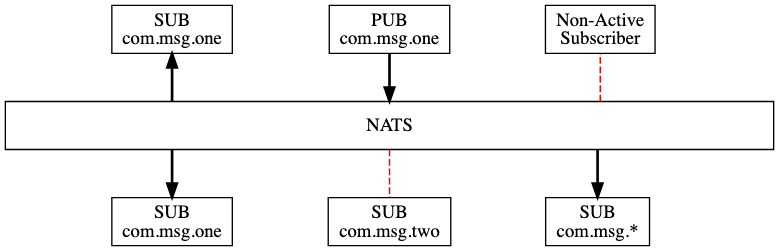

# NATS

https://docs.nats.io/

### Software applications and services need to exchange data.

NATS is an infrastructure that allows such data exchange, segmented in the form of messages. We call this a "**message oriented middleware**".

> Message-oriented middleware is software or hardware infrastructure supporting sending and receiving messages between distributed systems.
> 

**NATS Pub/Sub Walkthrough**

### **NATS Quality of service (QoS)**

**At-most once:** *Core NATS* is a fire-and-forget messaging system. It will only hold messages in memory and will never write messages directly to disk.

**At-least / exactly once QoS:** 

### What is "Acknowledgements”?

Subscribers can use auto-ack or manual-ack. Auto-ack is the default for most clients and is sent by the library when the message callback returns. Manual ack provides more control. The subscription options provide flags to:

### Error handling

- NATS died
    - 
- Subcriber died
    - 
- Publisher died