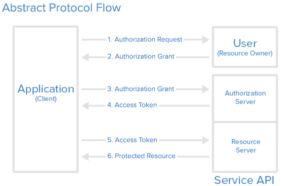

# RESTFUL API

# What is API?

An **application programming interface** is a way for two or more [computer programs](https://en.wikipedia.org/wiki/Computer_program) to communicate with each other.

### What is Rest?

REST stands for **Re**presentational **S**tate **T**ransfer. It is an **architecture style** for designing loosely coupled applications over the network, that is often used in the development of web services.

### REST API

A REST API (also known as RESTful API) is an application programming interface (API or web API) that conforms to the constraints of REST architectural style and allows for interaction with RESTful web services.

### **Architectural Constraints**

REST defines **6 architectural constraints** which make any web service – a RESTful API.

#### Uniform Interface
>
It is a key constraint that differentiate between a REST API and Non-REST API. It suggests that there should be an uniform way of interacting with a given server irrespective of device or type of application (website, mobile app). 
There are four guidelines principle of Uniform Interface are:
• Resource-Based: Individual resources are identified in requests. For example: API/users.
• Manipulation of Resources Through Representations: Client has representation of resource and it contains enough information to modify or delete the resource on the server, provided it has permission to do so. Example: Usually user get a user id when user request for a list of users and then use that id to delete or modify that particular user.
• Self-descriptive Messages: Each message includes enough information to describe how to process the message so that server can easily analyses the request.
• Hypermedia as the Engine of Application State (HATEOAS): It need to include links for each response so that client can discover other resources easily.

#### Stateless
>
Stateless: It means that the necessary state to handle the request is contained within the request itself and server would not store anything related to the session. In REST, the client must include all information for the server to fulfill the request whether as a part of query params, headers or URI. Statelessness enables greater availability since the server does not have to maintain, update or communicate that session state. There is a drawback when the client need to send too much data to the server so it reduces the scope of network optimization and requires more bandwidth.

#### Cacheable
>
Cacheable: Every response should include whether the response is cacheable or not and for how much duration responses can be cached at the client side. Client will return the data from its cache for any subsequent request and there would be no need to send the request again to the server. A well-managed caching partially or completely eliminates some client–server interactions, further improving availability and performance. But sometime there are chances that user may receive stale data.

#### Client-Server
>
Client-Server: REST application should have a client-server architecture. A Client is someone who is requesting resources and are not concerned with data storage, which remains internal to each server, and server is someone who holds the resources and are not concerned with the user interface or user state. They can evolve independently. Client doesn’t need to know anything about business logic and server doesn’t need to know anything about frontend UI.

#### Layered System
>
Layered system: An application architecture needs to be composed of multiple layers. Each layer doesn’t know any thing about any layer other than that of immediate layer and there can be lot of intermediate servers between client and the end server. Intermediary servers may improve system availability by enabling load-balancing and by providing shared caches.
REST allows you to use a layered system architecture where you deploy the APIs on server A, and store data on server B and authenticate requests in Server C, for example. A client cannot ordinarily tell whether it is connected directly to the end server or an intermediary along the way.

#### Code on Demand
>
Well, this constraint is optional. Most of the time, you will be sending the static representations of resources in the form of XML or JSON. But when you need to, you are free to return executable code to support a part of your application, e.g., clients may call your API to get a UI widget rendering code. It is permitted.

### Some rules

- REST is based on the resource or noun instead of action or verb based. It means that a URI of a REST API should always end with a noun. Example: /api/users is a good example, but /api?type=users is a bad example of creating a REST API.
- HTTP verbs are used to identify the action. Some of the HTTP verbs are – GET, PUT, POST, DELETE, GET, PATCH.
- A web application should be organized into resources like users and then uses HTTP verbs like – GET, PUT, POST, DELETE to modify those resources. And as a developer it should be clear that what needs to be done just by looking at the endpoint and HTTP method used.

| URI | HTTP VERB | DESCRIPTION |
| --- | --- | --- |
| /api/categories | GET | Get categories |
| /api/categories | POST | Add a new category |
| /api/categories/:id | DELETE | Delete a category |
| /api/categories/:id | PUT | Update a category |
| /api/categories/:id | GET | Get a category |

### ****HTTP Status Codes****

REST APIs use the **Status-Line** part of an HTTP response message to inform clients of their request’s overarching result

- 200: Success
- 201: Created
- 204: No Content
- 400: Bad request
- 401 Unauthorized
- 403: Forbidden
- 404: Not found
- 500: Internal Server Error


### Resource

In [REST](https://restfulapi.net/), the primary data representation is called **resource**. Having a consistent and robust REST resource naming strategy – will prove one of the best design decisions in the long term.

# References

https://restfulapi.net/rest-architectural-constraints/

https://developer.mozilla.org/en-US/docs/Web/HTTP/Status


---


# **Authentication/Authorization**

- Authentication is a process that verifies that someone or something is who they say they are.
- Authorization is the process of verifying what they have access to.


# Api authentication/authorization

### 1. **HTTP Authentication Schemes**

- Basic
    - This is the most straightforward method and the easiest. With this method, the sender places a username:password into the request header. The username and password are encoded with Base64, which is an encoding technique that converts the username and password into a set of 64 characters to ensure safe transmission.
    
    ```tsx
    Authorization: Basic bG9sOnNlY3VyZQ==
    ```
    
- Bearer
    - Bearer Auth is an HTTP authentication scheme that involves security tokens called bearer tokens. The bearer token allowing access to a certain resource or URL and most likely is a cryptic string, usually generated by the server in response to a login request.
    - Similarly to Basic authentication, Bearer authentication should only be used over HTTPS (SSL).
    
    ```tsx
    Authorization: Bearer <token>
    ```
    
- Digest
    
    
    

### 2. Api key


- Authorization Header
- Basic Auth
- Body Data
- Custom Header
- Query String

### 3. **OAuth 2.0**

- OAuth 2.0 is the industry-standard protocol for authorization — to obtain limited access to user accounts on an HTTP service. It works by delegating user authentication to the service that hosts a user account and authorizing third-party applications to access that user account. OAuth 2 provides authorization flows for web and desktop applications, as well as mobile devices.
- Roles
    - **Resource Owner**: The resource owner is the *user* who authorizes an *application* to access their account. The application’s access to the user’s account is limited to the scope of the authorization granted (e.g. read or write access)
    - **Client**: The client is the *application* that wants to access the *user*’s account. Before it may do so, it must be authorized by the user, and the authorization must be validated by the API.
    - **Resource Server**: The resource server hosts the protected user accounts.
    - **Authorization Server**: The authorization server verifies the identity of the *user* then issues access tokens to the *application*.



### **Access token and refresh token**


## **JSON Web Token (JWT)**

- Token is a string that contains some information that can be verified securely.
- JSON Web Token is an open industry standard used to share information between two entities, usually a client (like your app’s frontend) and a server (your app’s backend).
- They contain JSON objects which have the information that needs to be shared. Each JWT is also signed using cryptography (hashing) to ensure that the JSON contents (also known as JWT claims) cannot be altered by the client or a malicious party.


# References

https://www.okta.com/identity-101/authentication-vs-authorization/

https://blog.restcase.com/4-most-used-rest-api-authentication-methods/

https://www.digitalocean.com/community/tutorials/an-introduction-to-oauth-2
